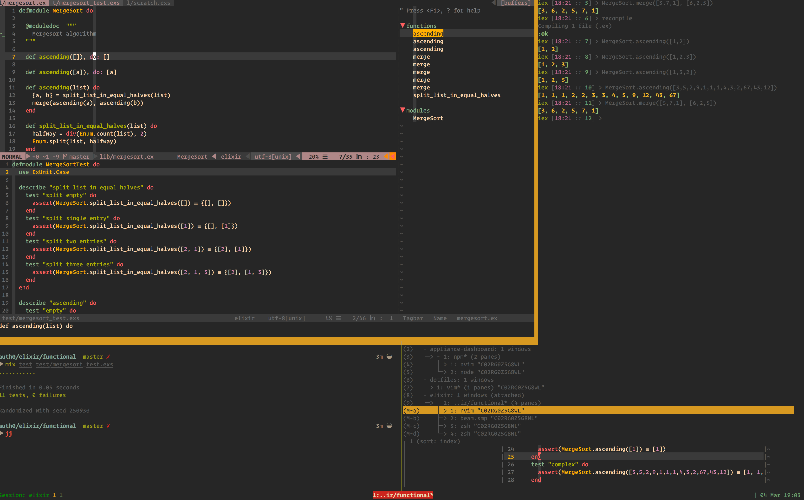
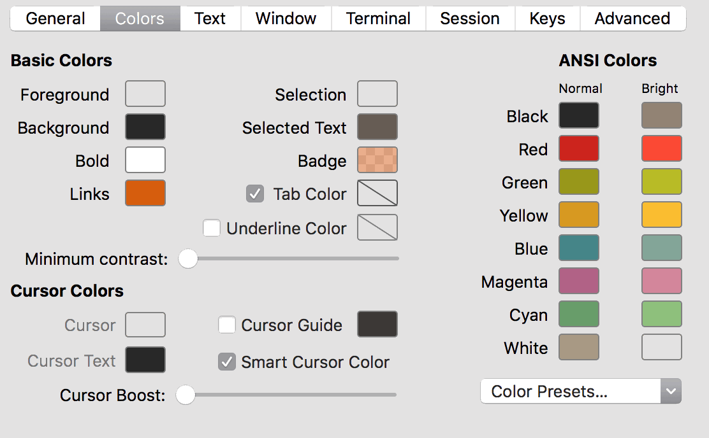
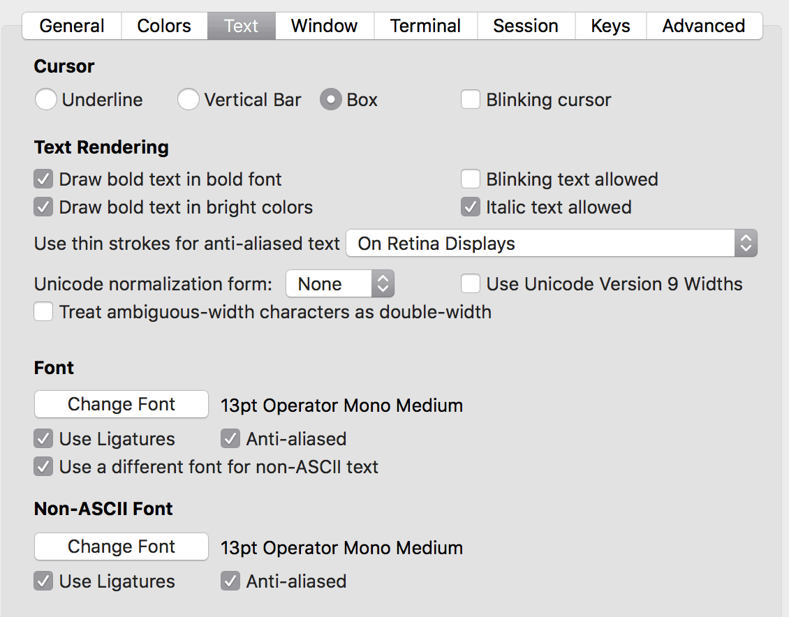

## VIM Setup

 

### Installing VIM

- brew install vim

### Configuring VIM with dotfiles

- mkdir ~/bin && cd $_
- git clone https://github.com/arcseldon/dotfiles-vim.git 
- mkdir -p dotfiles/vim/bundle
- git clone https://github.com/VundleVim/Vundle.vim.git ~/bin/dotfiles/vim/bundle/Vundle.vim
- cd ~
- ln -nfs ~/bin/dotfiles/vim/vimrc .vimrc
- ln -nfs ~/bin/dotfiles/agignore .agignore
- ln -nfs ~/bin/dotfiles/vim .vim
- vim +PluginInstall +qall   (alternatively launch vim and run :PluginInstall)

### ZSH (Optional)

Includes scripts for auto-loading tmux on shell startup

Install [oh-my-zsh](https://github.com/robbyrussell/oh-my-zsh) using [manual install](https://github.com/robbyrussell/oh-my-zsh#manual-installation)

```
git clone git://github.com/robbyrussell/oh-my-zsh.git ~/.oh-my-zsh
```

- ln -nfs ~/bin/dotfiles/zshrc .zshrc

### TMUX (Optional)

ln -nfs ~/bin/dotfiles/tmux.conf .tmux.conf

### Installs

    $ brew install git
    $ brew install vim
    $ brew install tmux
    $ brew install ctags
    $ brew install ack
    $ brew install ag
    $ brew install fzf 
    $ brew install reattach-to-user-namespace

### Tutorials

The `tuts` folder contains my “show notes” from presentations where I have discussed both VIM and TMUX.

- [VIM Tutorial](https://github.com/arcseldon/dotfiles-vim/blob/master/tuts/vimtutor.md)
- [TMUX Tutorial](https://github.com/arcseldon/dotfiles-vim/blob/master/tuts/tmux.md)

### Iterm2 Setup 

Am using `gruvbox` color scheme for Iterm2 - [Get Iterm2 & vim files here](https://github.com/morhetz/gruvbox)

 

For font settings, I am using `Operator Mono` with medium typeface.

 
