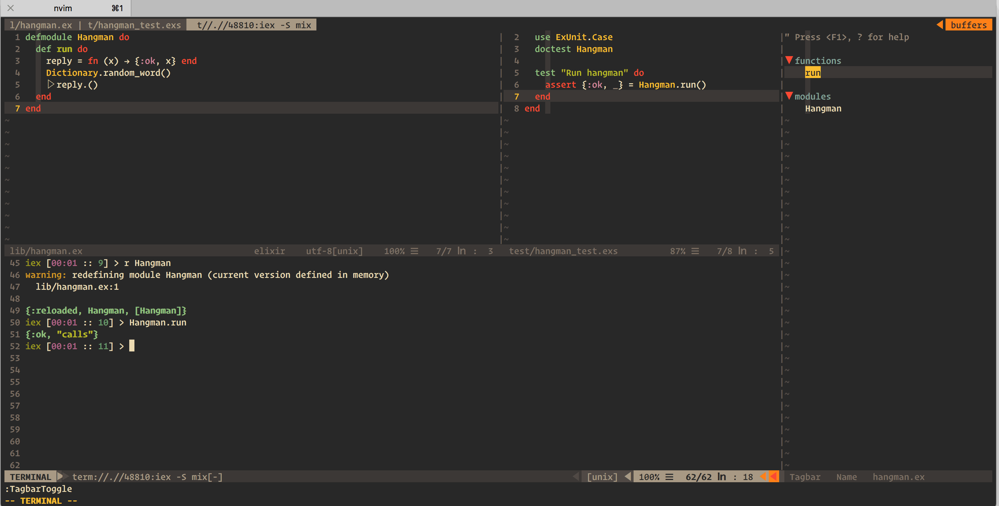

## VIM Setup

 

### Installing VIM

- brew install vim

### Configuring VIM with dotfiles

- mkdir ~/bin && cd $_
- git clone https://github.com/arcseldon/dotfiles-vim.git 
- mkdir -p dotfiles/vim/bundle
- git clone https://github.com/VundleVim/Vundle.vim.git ~/bin/dotfiles/vim/bundle/Vundle.vim
- cd ~
- ln -nfs ~/bin/dotfiles/vim/vimrc .vimrc
- ln -nfs ~/bin/dotfiles/agignore .agignore
- ln -nfs ~/bin/dotfiles/vim .vim
- vim +PluginInstall +qall   (alternatively launch vim and run :PluginInstall)

### TMUX (Optional)

ln -nfs ~/bin/dotfiles/tmux.conf .tmux.conf

### Installs

    $ brew install git
    $ brew install vim
    $ brew install tmux
    $ brew install ctags
    $ brew install ack
    $ brew install ag
    $ brew install reattach-to-user-namespace

###  VIM Tutorial

A [custom VIM
Tutorial](https://github.com/arcseldon/dotfiles-vim/blob/master/vim/vimtutor.md)
has been prepared that references all the standard VIM keyboard bindings, as
well as Plugin bindings and custom bindings that this set of VIM dotfiles is
configured for. It should be a great follow-up to the doing the standard VIM
`vimtutor` and reading the [Practical
Vim](https://pragprog.com/book/dnvim2/practical-vim-second-edition) by Drew
Neil.  It is the opinion of this author that both serve a great introductory
path to mastering VIM.

### Iterm2 Setup 

Am using `gruvbox` color scheme for Iterm2 - [Get Iterm2 & vim files here](https://github.com/morhetz/gruvbox)

 

For font settings, I am using `Operator Mono` with medium typeface.

 
